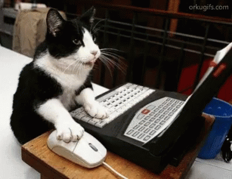
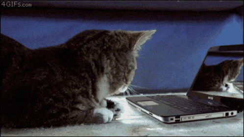

# Manutenzione Software

Ago <i class="fas fa-check"></i>

Sofia <i class="fas fa-check"></i>

BOB <i class="fas fa-ellipsis-h"></i> <i class="fas fa-check"></i>

Pino <i class="fas fa-ellipsis-h"></i> <i class="fas fa-check"></i>

ElisaBot <i class="fas fa-ellipsis-h"></i>

Sara <i class="fas fa-ellipsis-h"></i>

<!-- block-start: img -->

<!-- block-end -->

ALICE <i class="fas fa-times"></i>

martina <i class="fas fa-times"></i> <i class="fas fa-question"></i>

---

## martina ?

Siamo illegali in USA con le frequenze LoRa che usiamo attualmente.

<!-- block-start: little-space -->
<!-- block-end -->

- 433MHz <i class="fa fa-arrow-right"></i> EU <i class="fas fa-thumbs-up green"></i> - USA <i class="fas fa-thumbs-down red"></i>
- 868MHz <i class="fa fa-arrow-right"></i> EU <i class="fas fa-thumbs-up green"></i> - USA <i class="fas fa-thumbs-down red"></i>
- 900MHz <i class="fa fa-arrow-right"></i> EU <i class="fas fa-thumbs-down red"></i> - USA <i class="fas fa-thumbs-up green"></i>

<!-- block-start: little-space -->
<!-- block-end -->

La cosa positiva è che lo saremmo in qualunque caso, da qualche parte

<!-- block-start: img -->

<!-- block-end -->
